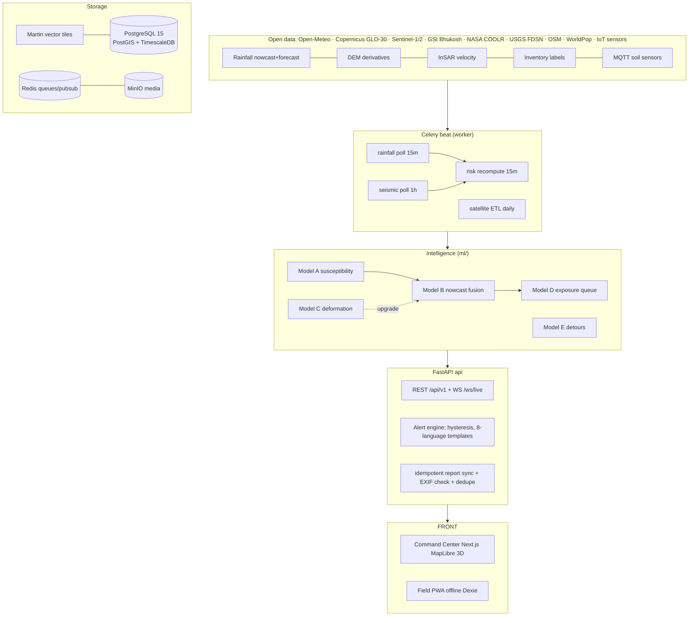

# BhuRakshak Architecture

> SIH26001 — AI-Based Early Warning and Landslide Risk Monitoring System in NER
> *From reactive response to predictive protection.*

## 1. The layered-warning concept (the core idea)

Most systems answer one question. BhuRakshak answers four, as separate fused layers:

| Layer | Question | Engine | Output |
|---|---|---|---|
| **A. Susceptibility** | WHERE can it happen? | XGBoost/LightGBM on 24 terrain/geology/land-cover features, **leave-one-district-out spatial CV** | static 0–100 score per cell → 5 GSI-compatible classes |
| **B. Hazard nowcast** | WHEN is it dangerous? | Interpretable Intensity–Duration thresholds per susceptibility class **fused** (max) with isotonic-calibrated LightGBM; 72h rainfall forecast features | hazard level L0–L4 per response zone, next 24–72h |
| **C. Deformation** | IS THE SLOPE MOVING? | Sentinel-1 PSInSAR LOS velocity → robust z-score → DBSCAN creep clusters | active creep zones; auto +1 hazard tier upgrade |
| **D. Exposure & response** | WHO / WHAT is in the way? | risk × population (WorldPop) × road criticality (NH>SH>village) × isolation | ranked response priority queue; road blockage prediction + NetworkX detours |

Fusion rule: `hazard_level = max(threshold_tier, calibrated_ML_tier)`.
Anti-flapping hysteresis: escalate only after **2 consecutive** ticks above candidate;
de-escalate after **3 consecutive** below. Answers the false-alarm-fatigue question.

## 2. System diagram

## 3. Stack rationale (defensible in Q&A)

| Choice | Why |
|---|---|
| FastAPI async + pydantic v2 | same language as ML; auto OpenAPI; WebSocket for live alerts |
| PostgreSQL 15 + PostGIS + TimescaleDB in ONE image (`timescale/timescaledb-ha`) | industry-standard geospatial + time-series without a second database |
| Martin (Rust) serving `zones`, `risk_cells`, `road_status` MVTs | what real geo-companies self-host; zero cost; MapLibre-ready at `/table/{z}/{x}/{y}.pbf` |
| Celery + Redis beat | scheduled ingestion survives crashes; Flower = ops visibility during demo |
| JWT access + rotating refresh tokens with **family reuse detection** | presenting a used refresh token revokes the whole family — bank-grade rotation |
| slowapi rate limits | login brute-force + demo endpoint protection |
| Next.js 14 + shadcn-style UI + ECharts | TypeScript safety pre-demo; SHAP waterfalls judges can interrogate |
| Vite PWA + Workbox + Dexie | installable, offline-first field reporting with idempotent batch sync by client UUID |

## 4. Data model highlights

- `zones` — ~5 km hex-grid polygons clipped to district boundaries (seed), zone codes `MZ-AIZ-047`.
- `risk_cells` — **current tile-serving state** (level, drivers JSONB, hysteresis counters). Rewritten by recompute task; geometry mirrored from `zones` so Martin serves a flat fast table.
- `risk_snapshots` / `rainfall_obs` / `displacement_series` / `sensor_readings` — Timescale **hypertables** (history + retention policy).
- `citizen_reports` — client-generated UUID PK ⇒ **idempotent offline sync**; EXIF geo-check flag; proximity dedupe (<50 m, <1 h, same category) merges into `dup_count`; verified reports feed hazard as soft signal.
- `alerts` — channels per level (push → sms → ivr → siren), ack workflow.
- `i18n_messages` — alert templates in en/hi/as/bn/ne/kha/lus/mni-Mtei with `{village},{level},{action}` slots.

## 5. API surface (v1)

Auth (JWT+rotation): `POST /auth/login|refresh|logout`, `GET /auth/me`
Zones: `GET /zones?bbox&district&level_min`, `GET /zones/{id}/dossier` (rain series, sensors, reports, alerts, SHAP drivers)
Reports: `POST /reports`, `POST /reports/sync` (batch idempotent), `PATCH /reports/{id}/verify` (RBAC district_admin+)
Alerts: `GET /alerts`, `POST /alerts/{id}/ack`, `POST /alerts/preview-fire` (judge button)
Roads: `GET /roads/status?bbox`, `GET /roads/detour` (NetworkX A* over seeded graph; OSMnx swap-in ready)
Demo: `POST /demo/inject-rainfall-storm` (runs the REAL pipeline on synthetic rain), `GET /demo/replay-event?event=noney_2022`
Analytics: `GET /analytics/kpis|backtest|registry`
Live: `WS /ws/live` (Redis pub/sub fan-out of risk diffs, alerts, sensor pings)

## 6. ML pipeline (ml/)

`ingest/dem.py` (GLO-30 hook + synthetic fractal DEM) · `ingest/inventory.py` (Bhukosh/COOLR loader + synthetic fallback) · `ingest/weather.py` (Open-Meteo archive, Kohler-Linsley effective rainfall, half-life 48 h) →
`models/susceptibility.py` (**LODO CV**, AUC printed per held-out district) · `models/hazard.py` (temporal split ≤2019 / 20–22 / 23–24, isotonic calibration) · `models/deformation.py` (robust z-score + DBSCAN) · `models/backtest.py` (POD/FAR/CSI + lead-time histogram → `demo/backtest_fixture.json` consumed by Analytics view) →
`registry/registry.py` (model_registry rows + docs/model-cards).

**Everything runs fully offline via deterministic synthetic data** (`make data`),
marked SYNTHETIC everywhere, until real datasets land (weeks 2–3 plan).

## 7. Deployment envelope

One `docker-compose.yml`, ~10 services, fits a 16 GB laptop (Postgres capped at 1.5 GB).
District onboarding = one GeoJSON feature in `data/pilot_districts.geojson` + `make seed`.

## 8. Honest limitations (preempt Q&A)

- Scaffold ships approximate district boundaries + synthetic susceptibility until GSI/DataMeet files are wired (`make data` real mode).
- InSAR layer is synthetic pending LiCSAR AOI processing; latency 6–12 d ⇒ slow-creep only (by design).
- Detour routing uses the seeded segment graph; full OSMnx graph lands with OSM extract ingestion.
- Khasi/Mizo/Meetei-Mayek strings need native-speaker review before finale (flagged TODO).
